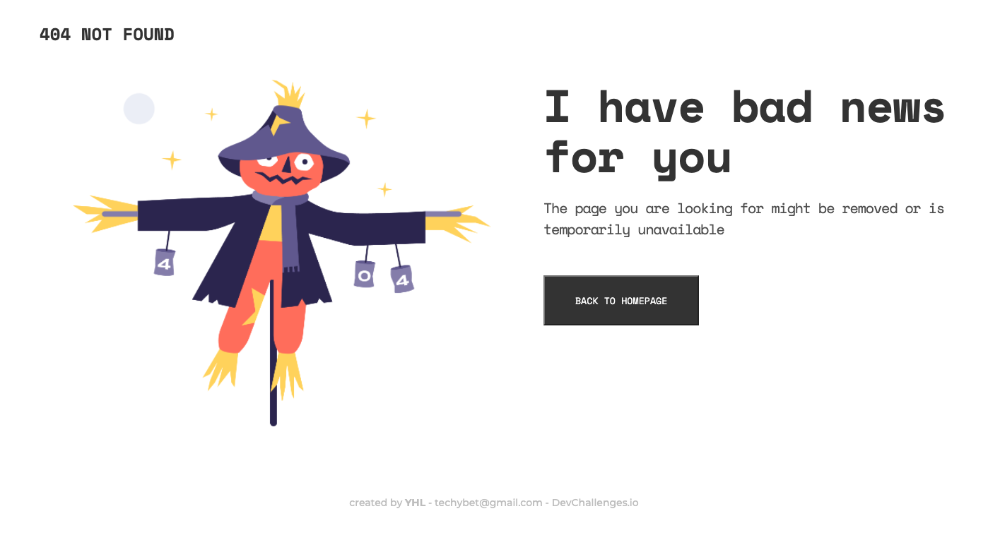

<!-- Please update value in the {}  -->

<h1 align="center">404 Not Found Page</h1>

   Solution for a challenge from  <a href="http://devchallenges.io" target="_blank">Devchallenges.io</a>.

  <h3>
    <a href="https://yhl-404page.netlify.app/">
      Demo
    </a>
     | 
    <a href="https://github.com/magotts/dc-404-page">
      Solution
    </a>
     | 
    <a href="https://devchallenges.io/challenges/wBunSb7FPrIepJZAg0sY">
      Challenge
    </a>
  </h3>

<!-- OVERVIEW -->

## Overview

Hi everyone! You can check out the live demo by clicking the Demo on top.
By creating more HTML and CSS websites, I didn't have a hard time creating the 404 page. It's my first time to use Figma. It's very convenient when it comes to figuring out what font/color/size the text is using.

I've learned that it is very important to be detailed. This page uses 3 fonts. If I hadn't check Figma, I wouldn't have known.

Keep on practicing until you are comfortable. :)

## Acknowledgements

<!-- This section should list any articles or add-ons/plugins that helps you to complete the project. This is optional but it will help you in the future. For exmpale -->

- [Steps to replicate a design with only HTML and CSS](https://devchallenges-blogs.web.app/how-to-replicate-design/)
- [Node.js](https://nodejs.org/)
- [Marked - a markdown parser](https://github.com/chjj/marked)

## Contact

- GitHub [@magotts](https://{github.com/magotts})

